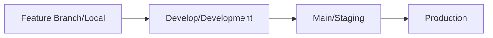

# Workflow CI/CD MyProf Backend

Ce document détaille la stratégie CI/CD mise en place pour le projet MyProf Backend, incluant les différentes étapes de validation et les environnements associés.

## Vue d'ensemble des Environnements



## Détail des Checks par Environnement

### 1. Feature Branch (Environnement Local)
Checks basiques mais essentiels pour assurer la qualité du code.

#### Checks Obligatoires :
- ✅ Compilation
- ✅ Tests Unitaires
- ✅ Checkstyle (style de code)
- ✅ Couverture de code basique (>70%)
- ✅ Analyse de sécurité basique (OWASP)
- ✅ Tests d'intégration spécifiques à la feature

### 2. Develop Branch (Environnement Development)
Validation plus approfondie avant intégration dans le flux principal.

#### Checks Obligatoires :
*Tous les checks de feature +*
- ✅ Tests d'intégration complets
- ✅ Couverture de code stricte (>80%)
- ✅ SonarQube Analysis
- ✅ Tests de performance basiques (JMeter)
- ✅ Tests de l'API complète
- ✅ Validation Swagger/OpenAPI
- ✅ Vérification des migrations MongoDB
- ✅ Tests de régression basiques

### 3. Main Branch (Environnement Staging)
Tests approfondis simulant l'environnement de production.

#### Checks Obligatoires :
*Tous les checks de develop +*
- ✅ Tests End-to-End complets
- ✅ Tests de charge (500+ utilisateurs simultanés)
- ✅ Tests de performance approfondis
- ✅ Tests de compatibilité multi-navigateurs
- ✅ Tests de sécurité approfondis
- ✅ Validation complète des données de test
- ✅ Tests de backup/restore
- ✅ Tests de rollback des migrations
- ✅ Validation des métriques de monitoring

### 4. Production Branch (Environnement Production)
Dernières vérifications avant mise en production.

#### Checks Obligatoires :
*Validation finale avant déploiement*
- ✅ Smoke Tests
- ✅ Tests de configuration
- ✅ Vérification des backups
- ✅ Validation des certificats SSL
- ✅ Check des variables d'environnement
- ✅ Validation des connexions aux services externes
- ✅ Tests de haute disponibilité
- ✅ Plan de rollback validé

## Processus de Promotion

### 1. Feature → Develop
**Local → Development**
```bash
# Création de la PR
- Créer PR de feature vers develop
- Exécution automatique des checks feature
- Code review obligatoire
- Merge si tous les checks passent
```

### 2. Develop → Main (Staging)
**Development → Staging**
```bash
# Promotion vers staging
- Créer PR de develop vers main
- Exécution des checks develop
- Tests staging automatiques
- Review par tech lead obligatoire
- Tests manuels en staging
- Merge après validation complète
```

### 3. Main → Production
**Staging → Production**
```bash
# Déploiement en production
- Créer PR de main vers production
- Exécution des checks staging
- Validation business requise
- Review par lead dev + architect
- Planning de déploiement validé
- Merge et déploiement selon planning
```

## Configuration des Environnements

### Base de Données MongoDB
- Local : MongoDB locale
- Development : MongoDB Atlas (cluster dev)
- Staging : MongoDB Atlas (cluster staging)
- Production : MongoDB Atlas (cluster prod)

### Sécurité et Configuration
- Secrets différents par environnement
- Variables d'environnement spécifiques
- Niveaux d'accès contrôlés
- Monitoring adapté à chaque environnement

## Points Importants

### Sécurité
- 🔒 Secrets gérés via GitHub Secrets
- 🔒 Accès restreints par environnement
- 🔒 Scan de sécurité régulier

### Qualité
- 📊 Métriques de qualité suivies
- 📊 Rapports de couverture générés
- 📊 Performance monitorée

### Documentation
- 📝 Documentation API à jour
- 📝 Changelog maintenu
- 📝 Procédures de déploiement documentées

### Monitoring
- 📈 Métriques de performance
- 📈 Logs centralisés
- 📈 Alerting configuré

## Maintenance

### Backups
- Automatisés sur tous les environnements
- Testés régulièrement
- Procédure de restore documentée

### Rollback
- Procédure définie par environnement
- Testée régulièrement
- Documentation à jour
