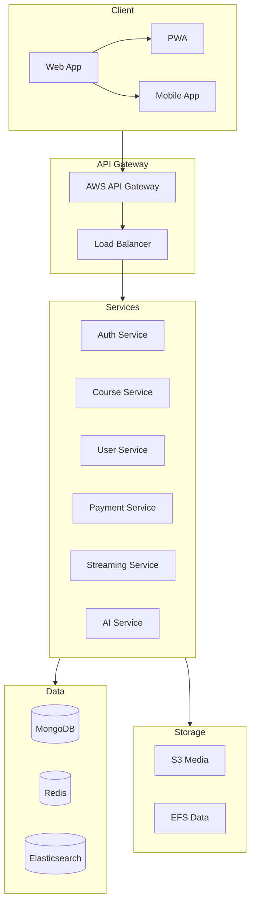
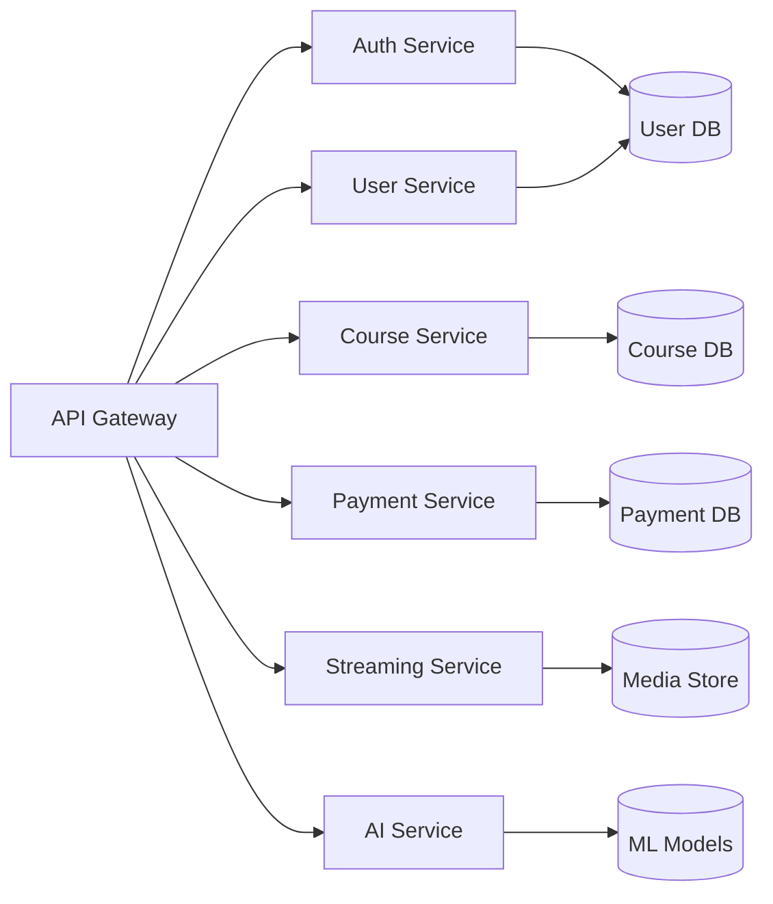
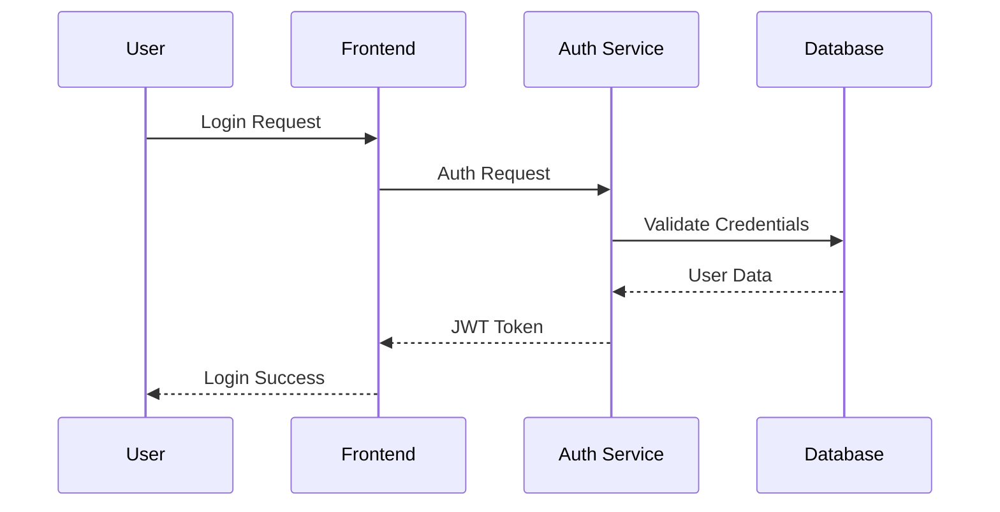
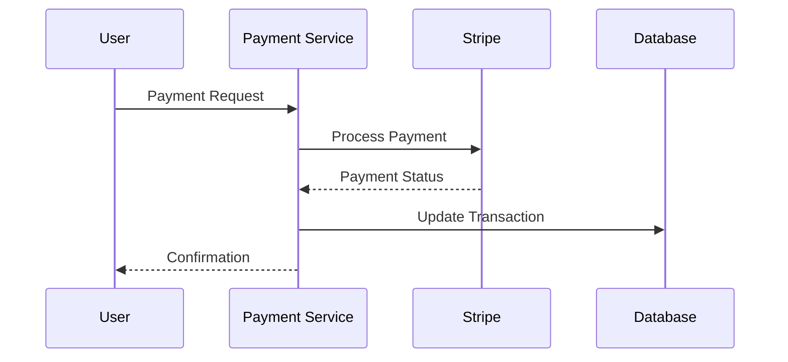
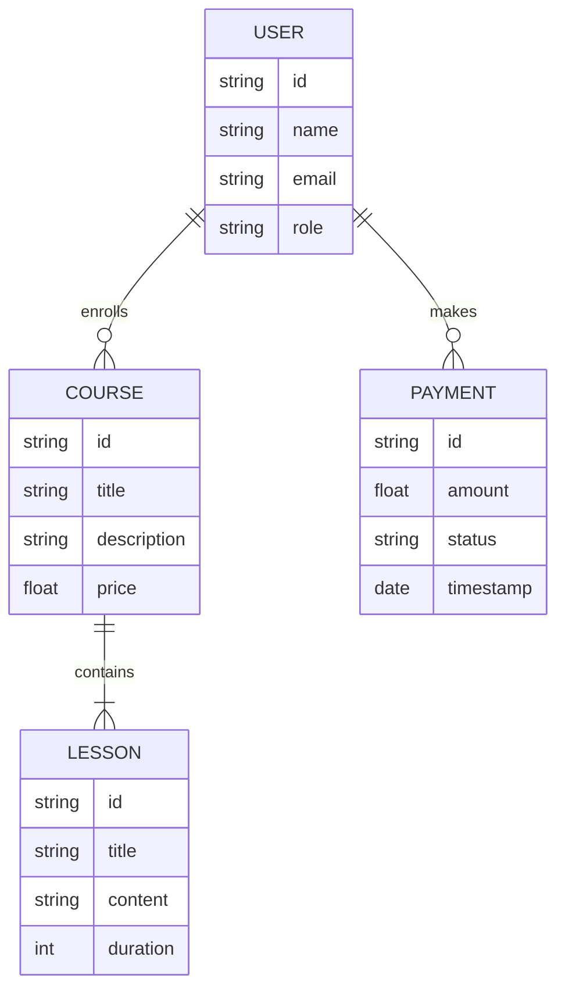
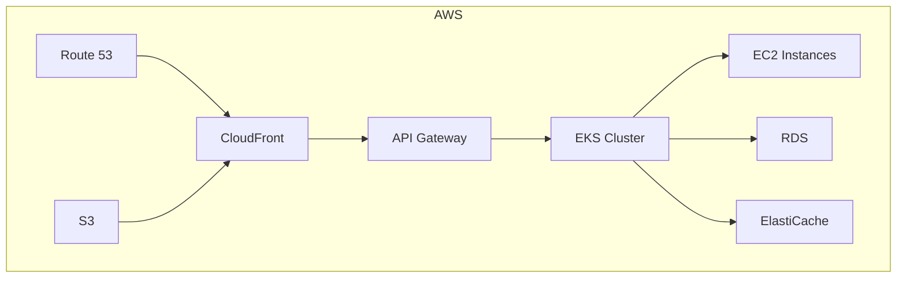
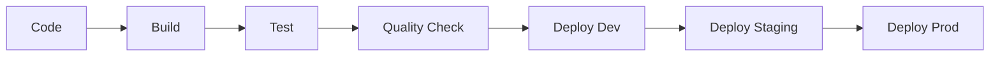
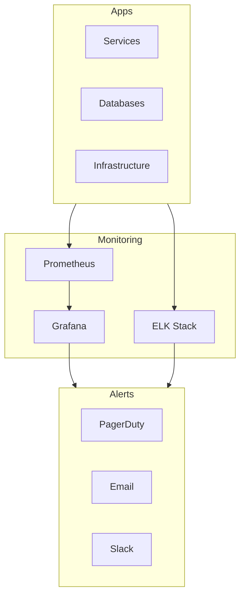

# Diagrammes d'Architecture MyProf

## Architecture Système

## Architecture de Microservices

## Flux d'Authentication

## Flux de Paiement

## Architecture de Données

## Infrastructure Cloud

## Pipeline CI/CD

## Monitoring System

